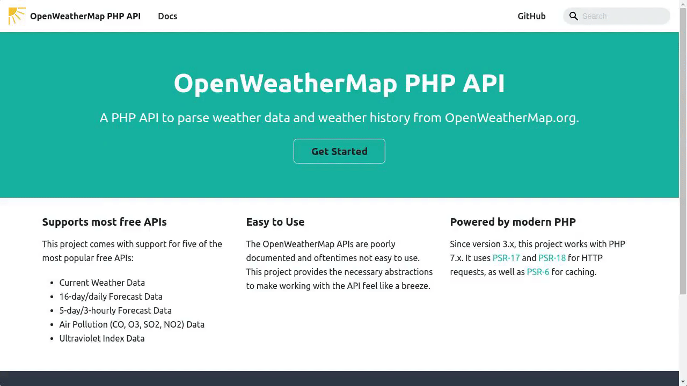

# Offline / Local Search for Docusaurus v2


[](https://github.com/prettier/prettier)


Offline / local search for Docusaurus **v2** that works behind your firewall.

Feature Highlights:
- Supports multiple documentation versions
- Supports documentation written in languages other than English
- Highlights search results
- Customized parsers for docs, blogs, and general pages
- Lazy-loads the index



## Installation

```bash
yarn add @cmfcmf/docusaurus-search-local
```

or

```bash
npm install @cmfcmf/docusaurus-search-local
```

## Usage

Add this plugin to the `plugins` array in `docusaurus.config.js`.

```js
module.exports = {
  // ...
  plugins: [
    require.resolve('@cmfcmf/docusaurus-search-local')
  ],

  // or, if you want to specify options:

  // ...
  plugins: [
    [require.resolve('@cmfcmf/docusaurus-search-local'), {
      // Options here
    }]
  ],
}
```

The following options are available (defaults are shown below):

```js
{
  // whether to index docs pages
  indexDocs: true,
  // must start with "/" and correspond to the routeBasePath configured for the docs plugin
  // use "/" if you use docs-only-mode
  // (see https://v2.docusaurus.io/docs/2.0.0-alpha.70/docs-introduction#docs-only-mode)
  docsRouteBasePath: '/docs',

  // Whether to also index the titles of the parent categories in the sidebar of a doc page.
  // 0 disables this feature.
  // 1 indexes the direct parent category in the sidebar of a doc page
  // 2 indexes up to two nested parent categories of a doc page
  // 3...
  //
  // Do _not_ use Infinity, the value must be a JSON-serializable integer.
  indexDocSidebarParentCategories: 0,

  // whether to index blog pages
  indexBlog: true,
  // must start with "/" and correspond to the routeBasePath configured for the blog plugin
  // use "/" if you use blog-only-mode
  // (see https://v2.docusaurus.io/docs/2.0.0-alpha.70/blog#blog-only-mode)
  blogRouteBasePath: '/blog',

  // whether to index static pages
  // /404.html is never indexed
  indexPages: false,

  // language of your documentation, see next section
  language: "en",

  // lunr.js-specific settings
  lunr: {
    // When indexing your documents, their content is split into "tokens".
    // Text entered into the search box is also tokenized.
    // This setting configures the separator used to determine where to split the text into tokens.
    // By default, it splits the text at whitespace and dashes.
    //
    // Note: Does not work for "ja" and "th" languages, since these use a different tokenizer.
    tokenizerSeparator: /[\s\-]+/
  }
}
```

You can now use the search bar to search your documentation.

**Important: Search only works for the statically built documentation (i.e., after you ran `yarn build` in your documentation folder).**

**Search does **not** work in development (i.e., when running `yarn start`).**

### Non-English Documentation

Use the `language` option if your documentation is not written in English. You can either specify a single language or an array of multiple languages.
The following languages are available:

    ar, da, de, en, es, fi, fr, hu, it, ja, nl, no, pt, ro, ru, sv, th, tr, vi

### Documentation Versions

Documentation versions created with the official Docusaurus docs plugin are supported.
The search bar defaults to the latest version (not `next`, but the latest version defined in `versions.json`) when not on a documentation page (e.g., when looking at a blog post or a static page).
If the user visits a documentation page, the version is extracted from the URL and search will only search documentatio of that version.
The searchbar placeholder text always reflects the currently detected documentation version.

### Debugging

If building your documentation produces an error, you can build it in debug mode to figure out
which page is causing it. To do so, simply set the `DEBUG` environment variable when building
your documentation: `DEBUG=1 yarn build`.

## CONTRIBUTING

Please see the [CONTRIBUTING.md](CONTRIBUTING.md) file for further information.

## License

MIT
